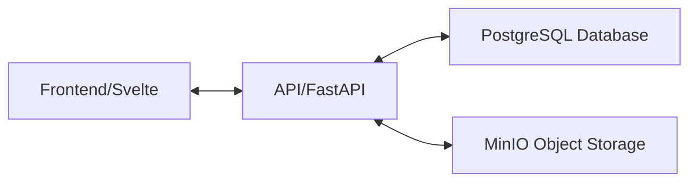

# Linguaweb Project

This project consists of a frontend and an API service, along with a PostgreSQL database and MinIO object storage. It uses Docker for containerization and orchestration.

## Architecture Diagram

## Getting Started

These instructions will get you a copy of the project up and running on your local machine for development and testing purposes.

### Prerequisites

- Docker
- Docker Compose

### Environment Variables

Please refer to the `.env.example` file in the root of the project for the environment variables that need to be set.

### Creating the .env file

1. Copy the `.env.example` file to `.env`.
2. Open the `.env` file and replace the placeholder values with actual values.

### Running the Project

1. Clone the repository.
2. Create the `.env` file as instructed above.
3. Run `docker-compose up`. Note that you may need to authenticate with GHCR to pull some of the images.

This will start the frontend on port 3000, the API on port 8000, the PostgreSQL database on port 5432, and the MinIO server on ports 9000/9001.
